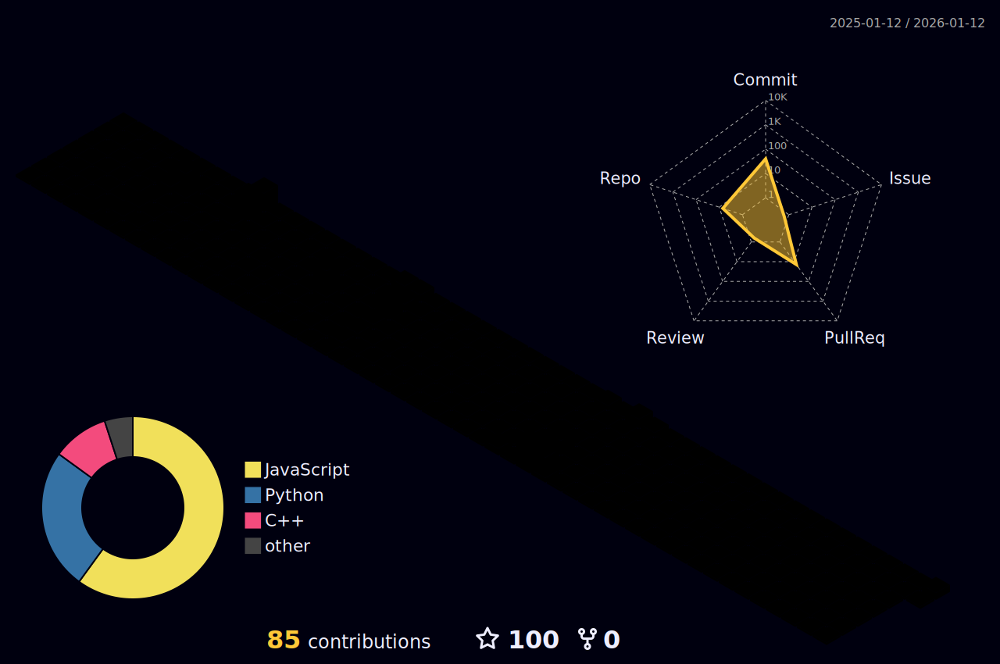

  

  <h3>🚀 Welcome to my digital space!</h3>
   
  

 

  

 

<!-- About Me Section -->

  
  <table align="center" style="border: none;">
    <tr>
      <td align="left" valign="center">
        <h3>👨‍💻 About Me</h3>
        
🎓 <b>Graduated from SLIIT</b> in Information Technology.

        
💻 Specializing in <b>Full Stack AI & ML Development</b>.

        
🤖 Passionate about <b>Robotics and Automation</b>.

        
🚀 Building intelligent solutions for <b>real-world problems</b>.

      </td>
    </tr>
  </table>
  

 

<!-- Expertise Section -->
<h2 align="center">⚡ What I Do</h2>
 

  <table align="center">
    <tr>
      <td align="center" width="25%">
        
         
        <b>Full Stack Development</b>
         
        Building scalable web applications using MERN, Spring Boot, and Next.js.
      </td>
      <td align="center" width="25%">
        
         
        <b>AI & ML Development</b>
         
        Creating intelligent systems with Python, TensorFlow, and PyTorch.
      </td>
      <td align="center" width="25%">
        
         
        <b>Mobile App Development</b>
         
        Crafting cross-platform apps using React Native and Flutter.
      </td>
      <td align="center" width="25%">
        
         
        <b>Robotics Engineering</b>
         
        Designing automated systems, IoT solutions, and embedded software.
      </td>
    </tr>
  </table>

 

<h2 align="center">🌟 3D Contribution Graph</h2>

  
  
<i>(This graph updates automatically every 24 hours)</i>

 

<h2 align="center">🐍 Coding Activity</h2>

  

 
 

<h2 align="center">🛠️ Tech Stack</h2>

  <kbd></kbd>
  <kbd></kbd>
  <kbd></kbd>
  <kbd></kbd>
  <kbd></kbd>
  <kbd></kbd>
  <kbd></kbd>
  <kbd></kbd>
  <kbd></kbd>
  <kbd></kbd>
  <kbd></kbd>
  <kbd></kbd>
  <kbd></kbd>
  <kbd></kbd>
  <kbd></kbd>
  <kbd></kbd>
  <kbd></kbd>
  <kbd></kbd>
  <kbd></kbd>
  <kbd></kbd>
  <kbd></kbd>
  <kbd></kbd>
  <kbd></kbd>
  <kbd></kbd>
  <kbd></kbd>
  <kbd></kbd>
  <kbd></kbd>
  <kbd></kbd>
  <kbd></kbd>
  <kbd></kbd>
  <kbd></kbd>
  <kbd></kbd>

 

 
 

<h2 align="center">📫 Connect with Me</h2>

  
  

 
 

  

